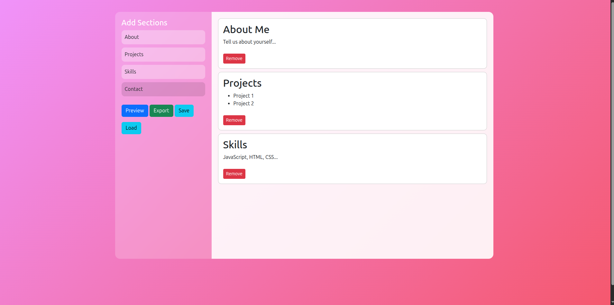

# Portfolio_Maker

The Interactive Portfolio Builder is a browser-based drag-and-drop application that allows users to visually build, preview, save, and export a personal portfolio website — all without writing code.

It demonstrates modern front-end techniques, animations, and client-side persistence using HTML, CSS, JavaScript, Bootstrap, and GSAP.

✨ Features

🖱️ Drag-and-Drop Section Builder

Add About, Projects, Skills, and Contact sections

Reorder and remove sections dynamically

✏️ Live Editing

All content is editable directly in the browser using contenteditable

🎞️ Smooth Animations

GSAP-powered transitions for tools, sections, previews, and notifications

👀 Live Preview Mode

Preview the final portfolio in a modal-style overlay

💾 Save & Load

Save portfolio progress using localStorage

Reload saved portfolios instantly

📤 Export to HTML

Download a clean, standalone portfolio.html file

Ready to deploy or host anywhere

🔔 User Feedback

Animated notifications for save, load, and export actions

🛠️ Technologies Used

HTML5

CSS3

Flexbox

Animations & gradients

JavaScript (Vanilla)

Drag & Drop API

DOM manipulation

Local Storage

Bootstrap 5

Responsive layout and UI components

GSAP (GreenSock Animation Platform)

High-performance animations

📂 Project Structure
/
├── index.html   # Complete application (HTML, CSS, JS)

No backend or build tools required.

▶️ How to Run

Clone or download the repository:

git clone https://github.com/your-username/interactive-portfolio-builder.git

Open the project folder.

Open index.html in any modern web browser.

Start building your portfolio 🚀

🧑‍💻 How It Works

Drag sections from the tool panel into the canvas

Click on text to edit content

Preview the portfolio layout

Save progress locally or export as an HTML file

📸 Screenshots (Optional)

💡 Learning Highlights

This project demonstrates:

Building a no-code style UI with pure JavaScript

Implementing drag-and-drop interactions

Creating reusable content templates

Managing application state with localStorage

Exporting dynamically generated HTML

Enhancing UX with professional animations

🔮 Possible Improvements

Section reordering via drag sorting

Theme customization (colors, fonts)

Markdown support for content

Cloud-based save using Firebase

Export to PDF

📄 License

This project is open-source and intended for learning, experimentation, and portfolio use.
